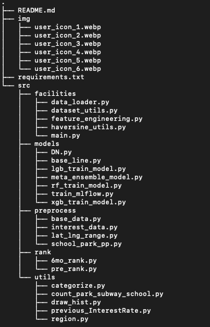

# 수도권 아파트 전세가 예측 모델

머신러닝 모델을 활용하여 수도권 아파트의 전세가의 예측 모델

 

## Team

| icon |  |  |  |  |  |  |
| :--: | :----------------------------------------------------------: | :----------------------------------------------------------: | :----------------------------------------------------------: | :----------------------------------------------------------: | :----------------------------------------------------------: | :----------------------------------------------------------: |
| 이름 |                            김민준                            |                            류지훈                            |                            한선우                            |                            양시영                            |                            이경민                            |                            신승훈                            |
| 담당 |                          EDA, Data                           |                          EDA, Data                           |                          EDA, Data                           |                          EDA, Data                           |                          EDA, Model                          |                          EDA, Model                          |
| 역할 |             EDA, Feature Engineering (기반시설)              |             EDA, Feature Engineering (기반시설)              |               EDA, Feature Engineering (금리)                |             EDA, Feature Engineering (지역 구분)             |                   EDA, Modeling (LightGBM)                   |                     EDA, Modeling (XGBM)                     |

 

## 폴더구조

 

## 프로젝트

### 목적

이 프로젝트는 머신러닝을 활용하여 한국 아파트 전세 실거래가를 예측하는 것을 목표로 합니다. 
다양한 주거 특성과 금융 지표 데이터를 활용하여 전세가를 예측하고, 부동산 시장의 정보 비대칭성을 해소하는 데 기여할 인공지능 알고리즘을 개발합니다. 

 

### 데이터

- **train.csv**: 전세 실거래가를 포함한 훈련 데이터
- **test.csv**: 추론용 데이터
- **sample_submission.csv**: 예측 결과 제출을 위한 샘플
- **subwayInfo.csv**: 지하철 위치 정보
- **interestRate.csv**: 금리 정보
- **schoolInfo.csv**: 학교 정보
- **parkInfo.csv**: 공원 정보

 

### 평가지표

**Mean Absolute Error (MAE)**

- **MAE**는 예측값과 실제값 간의 평균 절대 오차를 계산하는 지표로, 모델의 예측 성능을 평가하는 데 사용됩니다.

- **MAE**는 다음과 같이 정의됩니다:

  $$
  MAE=\frac{1}{n}\sum_{i=1}^{n}|y_i-\hat{y}_i|
  $$
  
  $$
  n : 데이터 개수, y_i : 전세 실거래 값, \hat{y}_i : 예측 전세 실거래 값
  $$

 

### 협업 방법

- 구글 공유 폴더: 회의록 작성 및 자료 공유
- MLflow: 머신러닝 실험 관리 및 저장
- Github: 코드 및 프로젝트 관리
- 기타 협업 툴 사용 (Zoom, Notion, Slack)

 

### Feature Engineering

| 데이터 구분     | 의미                                                         | Features                            |
| --------------- | ------------------------------------------------------------ | ----------------------------------- |
| 기반시설        | 아파트 반경 거리별 기반시설의 수                             | {facility}\_count\_{radius}m          |
|                 | 아파트 반경 거리별 기반시설의 존재유무                       | {facility}\_count\_{radius}m_presence |
| 기반시설 (rank) | 계약연월 기준 가장 가까운 주변시설의 6개월 전 rank           | {facility}\_rank                     |
|                 | rank를 가져온 주변시설까지의 거리                            | {facility}\_rank_distance            |
|                 | 각 rank와 distance를 활용한 weighted rank (rank / rank_distance) | {facility}\_wr                       |
| 예금/금리       | 시차(lag) 적용된 금리, 차분(정상성)                          | interest_rate_lag_diff              |
| 지역구분        | median point 부터의 거리(km)                                 | distance                            |
|                 | 거리 기반 중심 지역 여부                                     | distance_class                      |
|                 | KNN기반 예측 평균 실거래가                                   | pred_deposit                        |
|                 | KNN기반 중심 지역 여부                                       | cluster                             |

 

### Model

- Lightgbm
- xgboost
- Ridge

  

